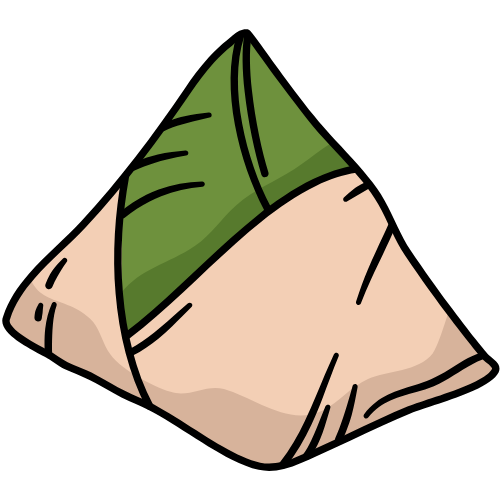
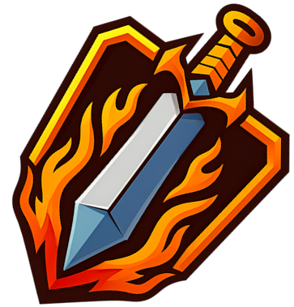
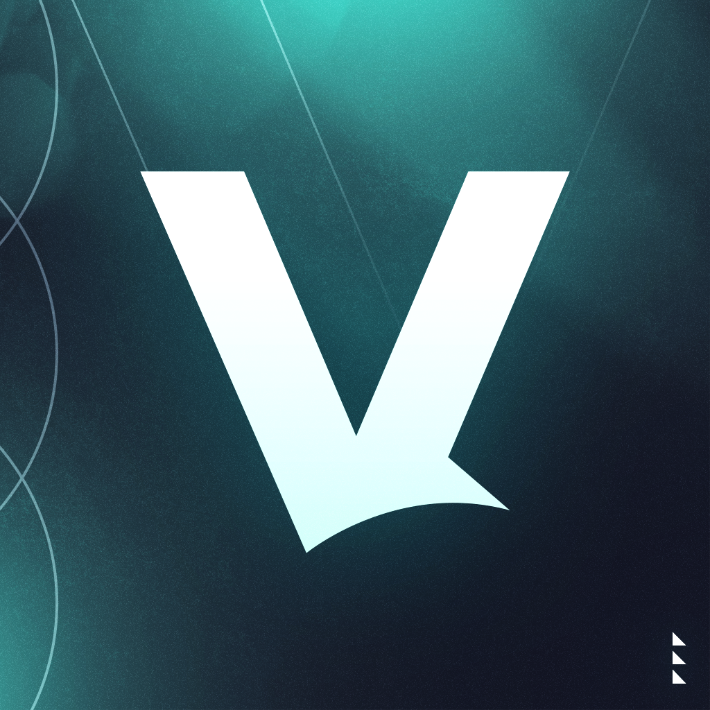
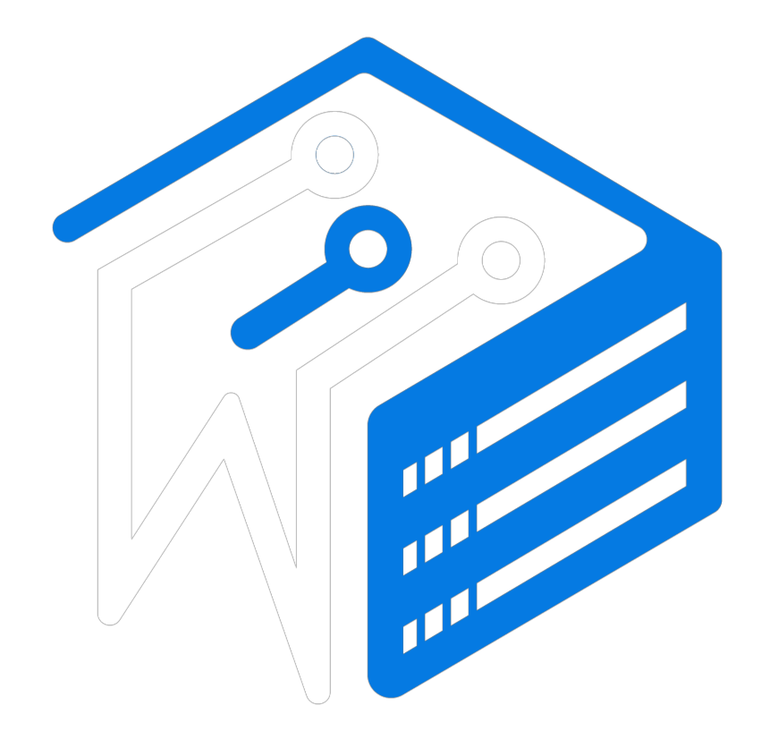
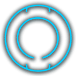
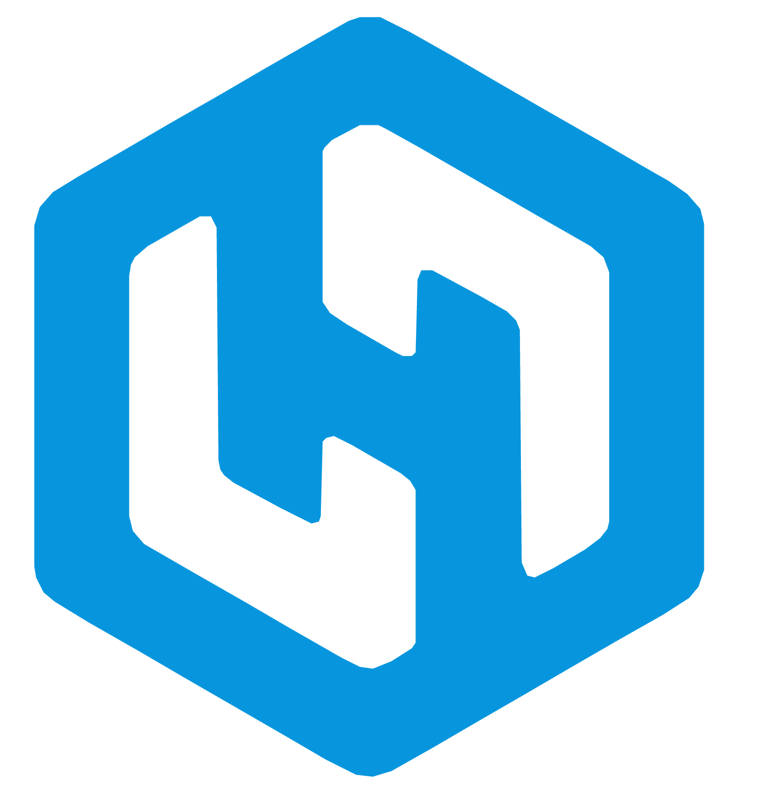

<div align="center">

# hey, I'm Meng 👋

_student · developer · creator_

[](https://github.com/Mengyboi)

</div>

---

### About Me

```yaml
name: Meng
based_in: Phnom Penh, Cambodia
status: Student by day, editing by night
currently: Learning, Exploring & Working
```

---

### Hobbies

- **Filming & Editing** - Premiere Pro and After Effects
- **Photography** - Lightroom
- **Gaming** - Sim Racing, Minecraft, R.E.P.O, etc....
- **Riding** - Breaking the law...

---

### What I work with and currently learning


---

### Currently

- Learning how to Color Grade
- Working on Sim Racing
- Balancing between waking up early or sacrificing sleep
- Planning a new route to take

---

### Experience

** Nasi Lemak** — _Co-Owner_ · `Feb 11, 2025 – Present`

> Promoted to Co-Owner after demonstrating my skills as a Developer. Helping shape the direction of the server.

** Nasi Lemak** — _Developer_ · `Late 2024 – Feb 11, 2025`

> Joined as a Developer and built up the server before stepping into a leadership role.

** sword.rip** — _Admin_ · `Oct 8, 2025 – Present`

> Joined as Admin and have been keeping the server running smoothly ever since.

** veltrix.club** — _Owner_ · `Jun 6, 2026 – Present`

> Stepped up to Owner after starting in Management. Leading the development of the server.

**** — _Management_ · `Oct 11, 2025 – Jun 6, 2026`

> Joined as Management, responsible for overseeing server operations and community.

** Refine Development** — _Media Management_ · `Dec 2023 – Present`

> Rejoined as Media Management after previously serving as Admin. Creating video content and showcasing development work including Bolt Practice Core, Carbon Spigot and also working on the GFX.

** WitherHosting** — _Head Support_ · `Jan 2026 – Present`

> Leading the support team at one of the best hosting communities out there — proud to grow into this role.

** WitherHosting** — _Support Member_ · `May 2023 – Jan 2026`

> Supporting one of the best hosting communities out there — great people, learned a ton.

** Alonefield (AKA The Grind)** — _Developer & Admin_ · `2021 – Mar 2023`

> The server that started it all. In charge of handling Practice, Prison, and other gamemodes. Where the dev journey really began.

** HumbleServers** — _Support Member_ · `Apr 2021 – Apr 2023`

> 2 years of support, met great people, and built a solid foundation of skills.

</div>
